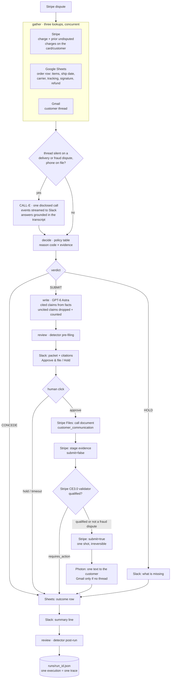
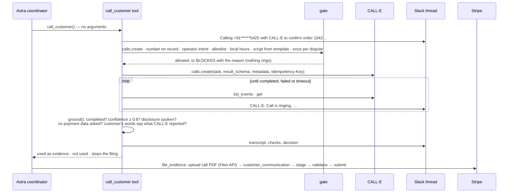
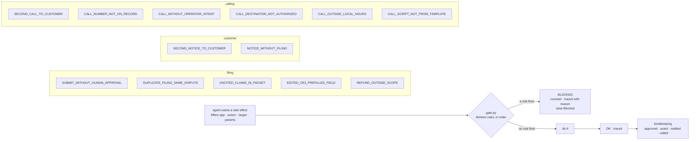
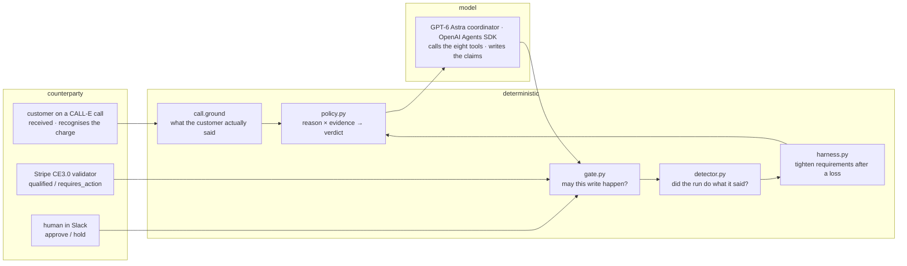
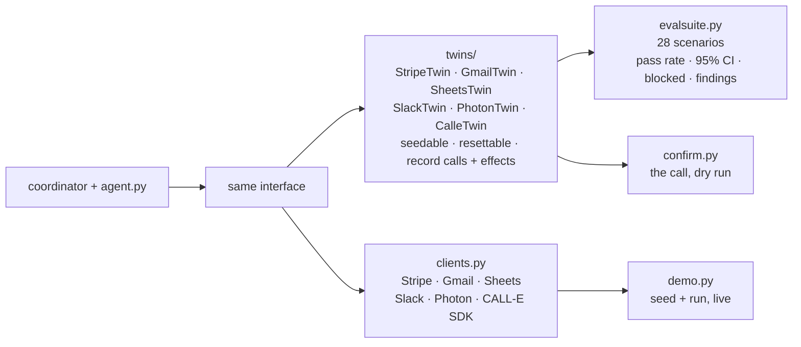

# Architecture

One coordinator (GPT-6 Astra on the OpenAI Agents SDK), eight tools over six external apps, one disclosed CALL-E call per dispute, three verdicts, one gate in front of every write.

## The run



Every box that touches an external app goes through the gate. The gate is not drawn on each edge because it is on every edge.

## The call



The model cannot choose the number or the words: `call_customer` takes no arguments, reads the number from the order record, and builds the task from one template, and the gate re-derives that template before the create. CALL-E's structured result is a claim; [`call.ground()`](rebuttal/call.py) decides what survives. A yes needs the customer's words; a no only needs to be possible.

## The gate



The rules are plain functions of `(effect, state) -> reason | None`, declared in a list. The state they read (`approved`, `acted`, `emailed`, `called`, `uncited_claims`, `live_call_intent`, `call_allowlist`) is written by the gate after a successful effect, by the packet builder for the uncited count, or by the operator at the start of a run. The model cannot touch it.

## Who decides what



The model writes prose and chooses the order of tools. Everything with a consequence is a table, a rule, a counterparty's answer, or a human's click.

## Twins



The coordinator does not know which one it has. The CALL-E twin mirrors the live `calls.create`, `calls.get` and `calls.list_events` payloads (verified against real calls), honours idempotency keys, and scripts the person who answers; the Stripe twin implements the CE3.0 grading rule; the Photon twin refuses cold threads like the real line.

## Data that crosses boundaries

| From | To | What | Where it is validated |
|---|---|---|---|
| Stripe | agent | dispute, charge, prior charges | reason code must be in the policy table, else HOLD |
| Sheets | agent | order row | column names fixed in `SheetsClient.ORDER_COLS`; booleans parsed |
| Gmail | agent | thread metadata + snippets | read-only; never quoted without a `gmail:` citation |
| agent | CALL-E | task, result schema, metadata, idempotency key | calling rules in the gate; E.164 check; task from one template |
| CALL-E | agent | events, transcript turns, structured result, confidence | `call.ground()`: completion, confidence, disclosure, no payment-data request, customer's words |
| model | agent | `{claims: [{text, source}]}` | every `source` must be a record id in the bundle, else dropped and counted |
| agent | Stripe | call document, evidence payload | PDF uploaded only for a usable call with a grounded yes; staged first; validator read before submit |
| agent | Slack | call thread, packet text + buttons | approval matched on message `ts`; timeout is HOLD |
| agent | Photon / Gmail | one customer note | one per dispute across both channels, only after a filing |

## Files

```
rebuttal/call.py        the confirmation call                  stdlib + reportlab, portable
rebuttal/confirm.py     the call from the command line          dry run by default
rebuttal/coordinator.py Astra coordinator, 8 gated tools        OpenAI Agents SDK
rebuttal/gate.py        write-gate, thirteen rules, trace       deterministic
rebuttal/policy.py      verdict table                           deterministic
rebuttal/agent.py       toolbox: clients, gather, assess        async, 3 concurrent lookups
rebuttal/detector.py    silent-failure detector                 deterministic
rebuttal/harness.py     tighten-only self-improvement           deterministic
rebuttal/twins/         six twins                               offline
rebuttal/clients.py     six real clients                        online
rebuttal/replay.py      a call as a replay file                 offline
rebuttal/evalsuite.py   scenario runner                         offline apps, real model
rebuttal/demo.py        seed + live run                         online
photon/send.mjs         Photon sidecar (Node, spectrum-ts)      online
scenarios/              28 seeded starting states, 9 calls
runs/                   one JSON trace per execution
```
