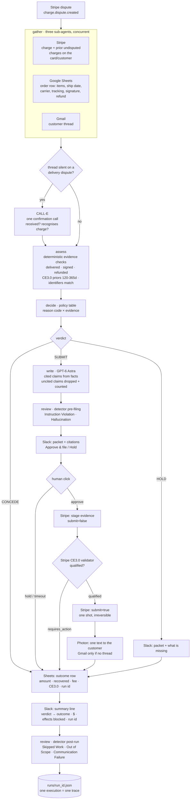
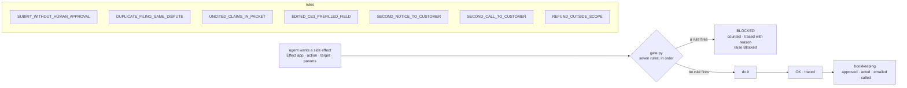
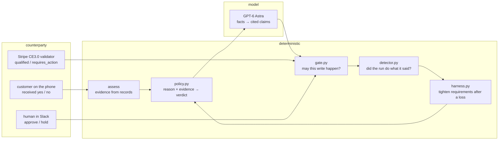
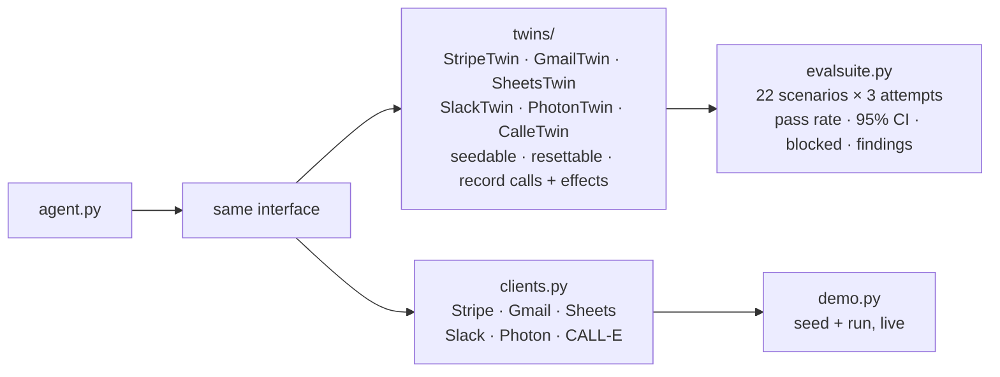

# Architecture

One orchestrator, six external apps, three verdicts, one gate in front of every write.

## The run



Every box on the right-hand column that touches an external app (Slack, Stripe, Photon, Gmail, Sheets, CALL-E) is a call through the gate. The gate is not drawn on each edge because it is on every edge.

## The gate



The rules are plain functions of `(effect, state) -> reason | None`, declared in a list. Adding a forbidden effect is adding a function. The state the rules read (`approved`, `acted`, `emailed`, `called`, `uncited_claims`) is written only by the gate itself after a successful effect, or by the packet builder for the uncited count. The model cannot touch it.

## Who decides what



The model writes prose. Everything that has a consequence is either a table, a rule, a counterparty's answer, or a human's click.

## Sub-agents

The three gather sub-agents run under `asyncio.gather`, each in a thread, each recording a `gather` span with `ok`, `empty` or `skipped`. `empty` means the query ran and found nothing, which is an answer. `skipped` means the query never ran because its input was missing, which is the silent failure the detector reports as Skipped Work. The distinction matters: the first live run of the night was green and `skipped`.

The CALL-E step is a fourth, conditional sub-agent. It runs only when the thread is silent on a delivery dispute and a phone is on file, and its structured result is appended to the facts with a `calle:` citation like any other record.

## Twins



The agent does not know which one it has. The Stripe twin implements the CE3.0 grading rule, the Photon twin refuses cold threads like the real line, the CALL-E twin answers with whatever the scenario scripted.

## Data that crosses boundaries

| From | To | What | Where it is validated |
|---|---|---|---|
| Stripe | agent | dispute, charge, prior charges | reason code must be in the policy table, else HOLD |
| Sheets | agent | order row | column names fixed in `SheetsClient.ORDER_COLS`; booleans parsed |
| Gmail | agent | thread metadata + snippets | read-only; never quoted without a `gmail:` citation |
| CALL-E | agent | `{received, recognises_charge}` | schema-constrained enum; `unknown` changes nothing |
| model | agent | `{claims: [{text, source}]}` | every `source` must be a record id in the bundle, else dropped and counted |
| agent | Stripe | evidence payload | staged first; the CE3.0 validator's answer is read before submit; prefilled fields never sent |
| agent | Slack | packet text + buttons | approval matched on message `ts`; timeout is HOLD |
| agent | Photon / Gmail | one customer note | one per dispute across both channels |

## Files

```
rebuttal/policy.py      verdict table                       deterministic
rebuttal/gate.py        write-gate, seven rules, trace       deterministic
rebuttal/agent.py       orchestrator                         async, 3 concurrent sub-agents + conditional call
rebuttal/model.py       Astra writer · FakeModel             one model call per run
rebuttal/detector.py    silent-failure detector              deterministic
rebuttal/harness.py     tighten-only self-improvement        deterministic
rebuttal/twins/         six twins                            offline
rebuttal/clients.py     six real clients                     online
rebuttal/evalsuite.py   scenario runner                      offline
rebuttal/demo.py        seed + live run                      online
photon/send.mjs         Photon sidecar (Node, spectrum-ts)   online
scenarios/              22 seeded starting states
runs/                   one JSON trace per execution
```
